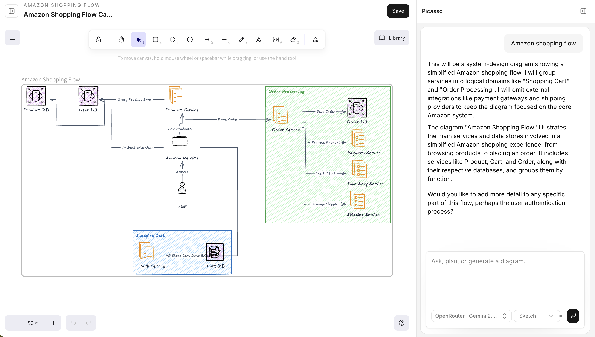
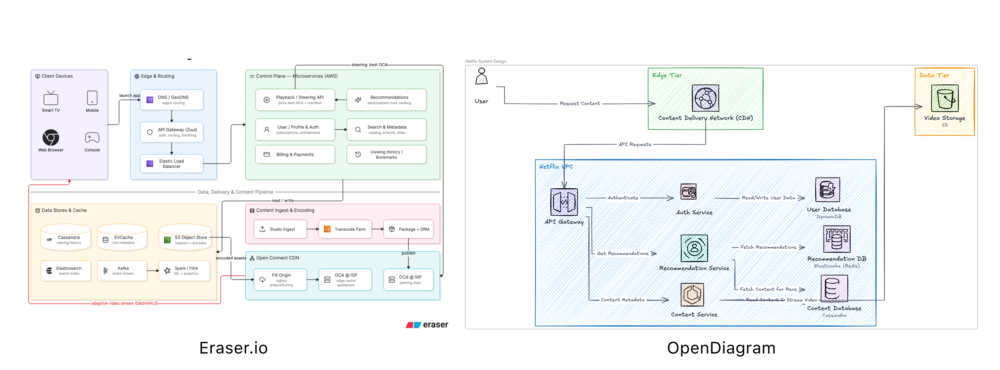

# Best DiagramGPT Alternative for Creating AI Diagrams

DiagramGPT helped popularize a faster way to create technical diagrams: describe what you need in plain English and let AI generate the visual structure.

Created by Eraser, DiagramGPT generates technical diagrams from text prompts or code. However, it may not suit everyone. You might want a simpler interface, a different visual style, or a tool focused specifically on turning ideas into diagrams.

One **DiagramGPT alternative** worth considering is **[OpenDiagram](https://opendiagram.ink/dashboard)**.

## What Is DiagramGPT?

DiagramGPT is Eraser’s AI-powered diagram generator. It allows users to enter a natural-language prompt or code snippet and generate a technical diagram without manually arranging every box, label, and connection.

It can create diagrams such as:

- Architecture diagrams
- Flowcharts
- Sequence diagrams
- Entity-relationship diagrams
- Cloud infrastructure diagrams

The generated diagram can then be refined within Eraser’s editor.

## Why Look for a DiagramGPT Alternative?

DiagramGPT works well for engineering teams already using Eraser for documentation and collaboration. However, you may prefer an alternative when you want:

- A more focused AI diagramming experience
- A straightforward prompt-to-diagram workflow
- Different visual layouts or diagram styles
- A simpler tool for individual projects
- Another option before committing to a larger documentation platform

The best tool depends on whether you need a complete engineering workspace or primarily want to generate diagrams quickly.

## OpenDiagram: A Focused DiagramGPT Alternative

**OpenDiagram** is an AI diagram generator that transforms natural-language prompts into structured visual diagrams.

Instead of manually drawing and connecting every element, you describe the system, process, or idea you want to visualize.

For example:

> Create an architecture diagram for a SaaS application with a Next.js frontend, Node.js API, PostgreSQL database, Redis cache, and Stripe integration.

OpenDiagram interprets the prompt and generates a visual representation of the components and their relationships.

This workflow can help:

- Developers document software architecture
- Founders explain product infrastructure
- Students visualize technical concepts
- Product teams map processes and workflows
- Teams communicate complex systems clearly

## How OpenDiagram Works

Creating a diagram with OpenDiagram follows a simple process:

1. Describe the diagram you want.
2. Let OpenDiagram generate the initial structure.
3. Review and refine the generated visual.
4. Export or share the finished diagram.

_OpenDiagram turns a natural-language description into a structured visual diagram._

The prompt should mention the diagram type, important components, and how those components are connected. More specific prompts generally produce more useful results.

## OpenDiagram vs DiagramGPT

Both OpenDiagram and DiagramGPT use AI to reduce the manual work involved in creating technical diagrams. However, they are designed around slightly different workflows.

| Feature                   | OpenDiagram                | Eraser.io / DiagramGPT |
| ------------------------- | -------------------------- | ---------------------- |
| AI generation from text   | Yes                        | Yes                    |
| Output format             | Native Excalidraw elements | Proprietary            |
| Editable after AI draws   | Full canvas editing        | AI-only editing        |
| Bring your own AI key     | Yes                        | No                     |
| Persistent project memory | Yes                        | No                     |
| Free usage                | Yes                        | Limited credits        |

DiagramGPT is integrated into Eraser’s wider engineering workspace. OpenDiagram is intended for users who want a direct way to transform written ideas into visual diagrams.

### Comparing the Output

The clearest way to compare AI diagram generators is to give both tools the same prompt.

_OpenDiagram and DiagramGPT outputs created using the same architecture prompt._

When comparing the results, look at:

- Diagram readability
- Component accuracy
- Layout quality
- Ease of editing
- Time required to reach a usable result

Avoid judging a tool from a single generation. Complex prompts may require refinement regardless of which AI diagram generator you use.

## Which Tool Should You Choose?

Choose **DiagramGPT** when you want AI diagram generation inside a broader engineering documentation and collaboration platform.

Choose **OpenDiagram** when you want a focused tool for quickly transforming prompts and ideas into structured diagrams.

There is no universal winner. The right choice depends on whether you prioritize a complete documentation workspace or a simpler diagram-generation workflow.

## Try a DiagramGPT Alternative

AI diagram generators make it possible to move from an idea to a visual explanation without spending hours dragging boxes and arrows.

With OpenDiagram, you can describe what you want to visualize and generate an AI diagram from your prompt.

**[Create an AI diagram with OpenDiagram](https://opendiagram.ink)**

---

## Frequently Asked Questions

### What is the best DiagramGPT alternative?

The best DiagramGPT alternative depends on your workflow. OpenDiagram is an option for users who want a focused prompt-to-diagram experience, while other tools may prioritize manual editing, team collaboration, or broader documentation features.

### Is DiagramGPT owned by OpenAI?

No. DiagramGPT is a product created by Eraser. It uses generative AI to create technical diagrams from text or code.

### Can OpenDiagram generate architecture diagrams?

Yes. OpenDiagram can transform a description of an application or system into an AI-generated architecture diagram.

### Can AI-generated diagrams be inaccurate?

Yes. An AI diagram generator may misunderstand a relationship, omit a component, or make an incorrect assumption. Always review the generated diagram before using it as official technical documentation.
