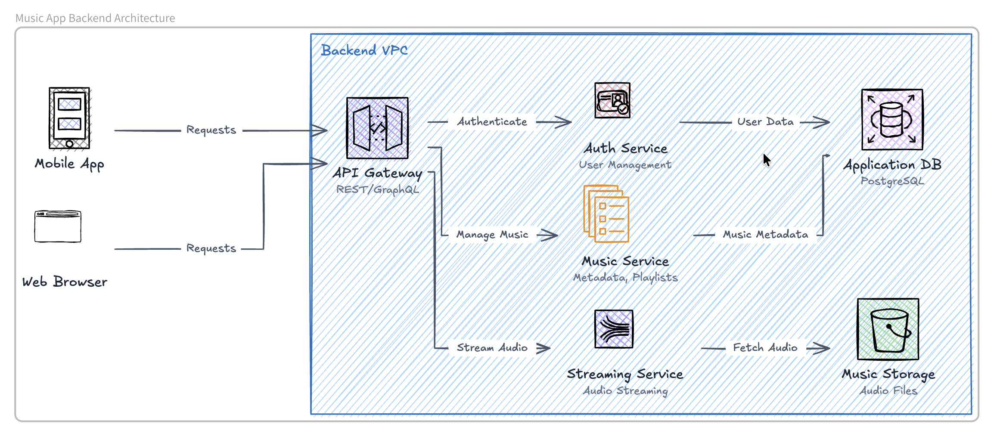

<!-- truncate -->

# What Is an AI Diagram? How AI Diagram Generators Work

An **AI diagram** is a visual representation generated by artificial intelligence from a text prompt. Instead of manually arranging shapes, labels, and connectors, users describe what they want, and an AI diagram generator transforms that description into a structured visual.

AI diagrams can be used to create flowcharts, system architecture diagrams, database diagrams, sequence diagrams, cloud architecture diagrams, and other technical visuals. Tools such as OpenDiagram and Eraser AI make it possible to generate these diagrams using simple natural-language instructions.

## How Does an AI Diagram Work?

An AI diagram generator analyzes a text prompt, identifies the important components and relationships, and converts them into a visual structure.

For example, a user might enter:

> Create an AI diagram for a web application with a React frontend, Node.js backend, PostgreSQL database, and Redis cache.

The AI identifies the technologies, understands how they interact, and generates a diagram showing the connections between them.

## Types of AI Diagrams

An AI diagram generator can create several types of diagrams depending on the information provided in the prompt.

### AI Architecture Diagram

An AI architecture diagram shows the components of a software system and how they communicate, includes frontends, backend services, databases, APIs, cloud platforms, and authentication systems.

Architecture diagrams are useful for planning applications, explaining technical systems, and documenting infrastructure.

### AI Flowchart

An AI flowchart represents a process as a sequence of steps and decisions. Users can describe a workflow in plain language, and the AI turns it into connected nodes and arrows.

For example, an AI flowchart could visualize a user registration process, payment workflow, approval process, or customer support journey.

### AI Database Diagram

An AI database diagram represents tables, fields, and relationships within a database. It can help developers create entity-relationship diagrams from a written description of their data model.

For example, a prompt describing users, products, orders, and payments can be converted into a database diagram showing how those entities are connected.

### AI Sequence Diagram

An AI sequence diagram displays how users, applications, APIs, and services communicate over time. It is especially useful for visualizing authentication flows, API requests, payment processing, and interactions between distributed services.

### AI Cloud Architecture Diagram

An AI cloud architecture diagram visualizes cloud infrastructure, including servers, databases, storage services, queues, networks, and third-party integrations.

Developers can use it to document systems deployed on platforms such as AWS, Microsoft Azure, or Google Cloud.

## AI Diagram vs Traditional Diagram

A traditional diagram is usually created manually using a visual editor. The user must select shapes, position elements, draw connections, and maintain the layout.

An AI diagram begins with a text prompt. The AI handles much of the initial structure and layout automatically.

| Traditional diagram                      | AI diagram                              |
| ---------------------------------------- | --------------------------------------- |
| Created manually                         | Generated from a prompt                 |
| Requires arranging shapes and connectors | AI organizes the visual structure       |
| Can take significant time                | Initial draft can be generated quickly  |
| Updates must be made manually            | Can be revised through new instructions |
| Often requires tool-specific experience  | Accessible through natural language     |

AI diagrams do not completely replace traditional diagramming tools. Instead, they reduce the time needed to create the first version and make diagram creation more accessible.

## How to Create a Good AI Diagram

The quality of an AI diagram depends heavily on the quality of the prompt. A clear prompt should specify:

- The type of diagram required
- The main components
- The relationships between components
- The direction of the workflow
- Any technologies or services involved
- The desired level of detail

For example, instead of writing:

> Create a diagram for my application.

Use a more detailed prompt:

> Create an AI architecture diagram for an e-commerce application with a Next.js frontend, Node.js API, PostgreSQL database, Stripe payment integration, Redis cache, and AWS S3 file storage.

The second prompt gives the AI enough information to create a more accurate and useful diagram.

## Who Can Use AI Diagrams?

AI diagrams are useful for many different users, including:

- Software developers documenting application architecture
- Engineering teams planning technical systems
- Product managers explaining product workflows
- Students visualizing complex concepts
- Founders presenting product infrastructure
- Business teams documenting operational processes
- Designers mapping user journeys

Anyone who needs to explain a process, system, or relationship visually can benefit from an AI diagram generator.

## Are AI Diagrams Accurate?

An AI diagram can generate a strong starting point, but its accuracy depends on the prompt and the complexity of the system.

AI may misunderstand relationships, omit components, or make assumptions that were not included in the prompt. For that reason, users should review the generated diagram and make corrections when necessary.

AI diagrams are most effective as editable drafts rather than unquestionable final documentation.

## The Future of AI Diagrams

AI diagrams are changing diagram creation from a manual design task into a conversational process.

Instead of drawing every component, users can describe a system and let AI generate the visual structure. Future AI diagram tools may also be able to analyze codebases, technical documentation, databases, and cloud environments to automatically create and update diagrams.

As these tools improve, AI diagrams are likely to become an increasingly important part of software development, technical documentation, education, and business communication.

## Conclusion

An **AI diagram** is a diagram created with artificial intelligence from a natural-language prompt. It allows users to quickly generate flowcharts, architecture diagrams, database diagrams, sequence diagrams, and other visual representations without manually building every element.

By making diagram creation faster and more accessible, AI diagram generators help people transform complex ideas into clear, editable visuals.
